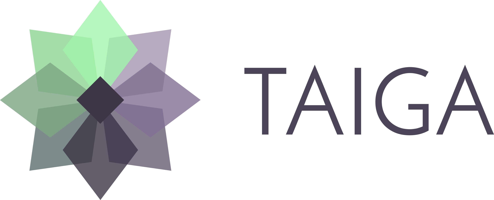

= Taiga Documentation
:toc: left
:toclevels: 1

Free. Open Source. Powerful. _Taiga_ is a project management platform for startups
and agile developers & designers who want a simple, beautiful tool that makes work
truly enjoyable.

Version: 6 Lynx lynx

[[installation-guide]]
== Installation Guide

This section details everything you need to know to get _Taiga_ up and running in production environments.

=== Setup Production Environment with Docker [Recommended]

link:setup-production.html#setup-prod-with-docker[This document contains the complete tutorial for installation with docker] of how
to properly setup _Taiga_ for a low traffic production environment.

=== Setup Production Environment from Source Code

link:setup-production.html#setup-prod-from-source-code[This document contains the complete, step by step tutorial] of how
to properly setup _Taiga_ for a low traffic production environment.

=== Setup FAQs and common Bugs

You can view a list of common FAQs and bugs related to the setup process link:setup-faqs.html[FAQs and common bugs].

[[upgrading-guide]]
== Upgrading Guide

This section explains how to upgrade your current Taiga to a newer version

=== Upgrade Taiga6 docker

This section shows how to keep your link:upgrades-6to6.html[taiga-docker instance up to date] with the new releases.

=== Upgrade from Taiga5 to Taiga6

Update your link:upgrades-5to6.html[Taiga5 instance to a new Taiga6 version].
This section covers different upgrade scenarios:

- from Taiga5 source code to Taiga6 in docker
- from Taiga5 in docker to Taiga6 in docker
- from Taiga5 source code to Taiga6 source code

=== Older versions

Update between link:upgrades-older.html[versions].

[[development]]
== Development

This section details everything you need to know to get _Taiga_ up and running in development environments.

=== Setup Development Environment

You can view the complete documentation on how to link:setup-development.html[setup a proper development environment].

[[api]]
== API

_Taiga_ has a complete REST API (the one used by the web app), check the full API documentation link:api.html[here].

[[importers]]
== Importers

Checkout the documentation about how to import a project link:https://resources.taiga.io/extend/importer-github/[from Github], link:https://resources.taiga.io/extend/importer-jira/[from Jira], or link:https://resources.taiga.io/extend/importer-trello/[from Trello].

If you're using a self-hosted _Taiga_, check the link:importers.html[documentation] to integrate them in your instance.

[[webhooks]]
== Webhooks

_Taiga_ has a webhook notification system, to easily integrate with third party systems.

Check the documentation about how to link:webhooks-configuration.html[configure webhooks] or the detailed link:webhooks.html[webhooks payload] if you'd like to integrate your own system with Taiga webhooks.

[[integrations]]
== Integrations

You can integrate _Taiga_ with:

**Repositories**

* link:integrations-github.html[GitHub]
* link:integrations-gitlab.html[Gitlab]
* link:integrations-bitbucket.html[Bitbucket]
* link:integrations-gogs.html[Gogs]

**Chats**

* link:integrations-slack.html[Slack]

[[how-to-contribute]]
== Contribute to Taiga

Because _Taiga_ is an open source project, we gratefully accept contributions in various forms. There are many different ways to contribute to Taiga's platform, from patches, to documentation and UI enhancements, just find the one that best fits with your skills. Check out our link:https://resources.taiga.io/extend/how-can-i-contribute[detailed contribution guide] if you'd like to support Taiga.

[[contrib-plugins]]
== Contrib Plugins

Taiga supports the inclusion of contrib plugins, and the community has developed a fair bunch of them, adding different functionalities round Taiga. You can check the list of link:https://resources.taiga.io/extend/contributions[contributions] as well as a link:https://resources.taiga.io/extend/how-to-extend-taiga[detailed tutorial] on the many ways to extend Taiga.

[[themes]]
== Themes

Taiga support themes: it allows customizing app colors and overwriting or adding CSS to any part of Taiga.

Duplicate the folder `taiga` (or another theme) under `/app/themes` and rename it with the theme name.

You'll find two files inside:

* `variables.scss` - to override sass variables, fonts, mixins helpers, etc.

* `custom.scss` - to override any defined Taiga style for any module or layout.

Remember, the file `variables.scss` should only contain sass declarations that do not generate code by themselves (like variables or mixins).

If you need to override a style and generate some new CSS, you should do it in `custom.scss`.

Please, check the default Taiga theme to understand how these files work properly.

Add the theme to the theme array in `dist/conf.json`.

Deploy your code

[source]
----
gulp deploy
----

After that, you should be able to update your theme from your user profile in your user settings.

If you create public themes, please share it with the community. Share the link in social media and ping link:http://twitter.com/taigaio/[@taigaio].

[[community]]
== Community

link:http://groups.google.com/d/forum/taigaio[Taiga has a mailing list]. Feel free to join it
and ask any questions you may have.

To subscribe for announcements of releases, important changes and so on, please follow
link:https://twitter.com/taigaio[@taigaio] on Twitter or read our link:https://blog.taiga.io[blog].

[[license]]
== License

Every code patch accepted in the Taiga codebase is accepted under the MPL-2 license. It is important
that you do not include any code which cannot be licensed under MPL-2.

You can see the complete license in the `LICENSE` file in the root of the repository.
