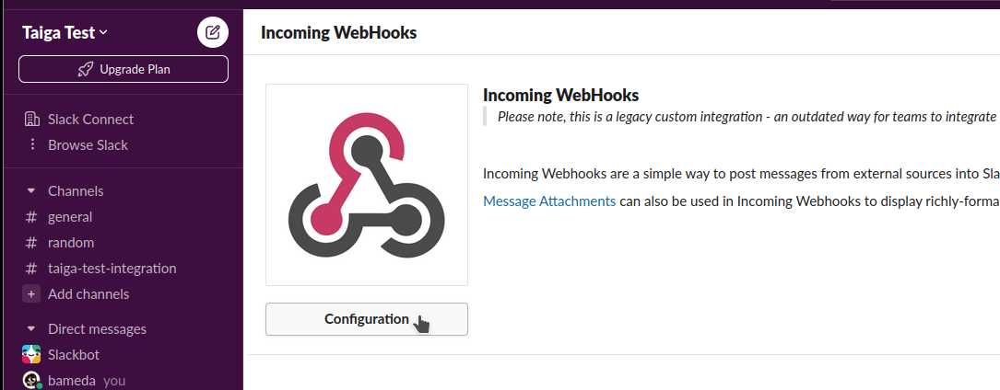
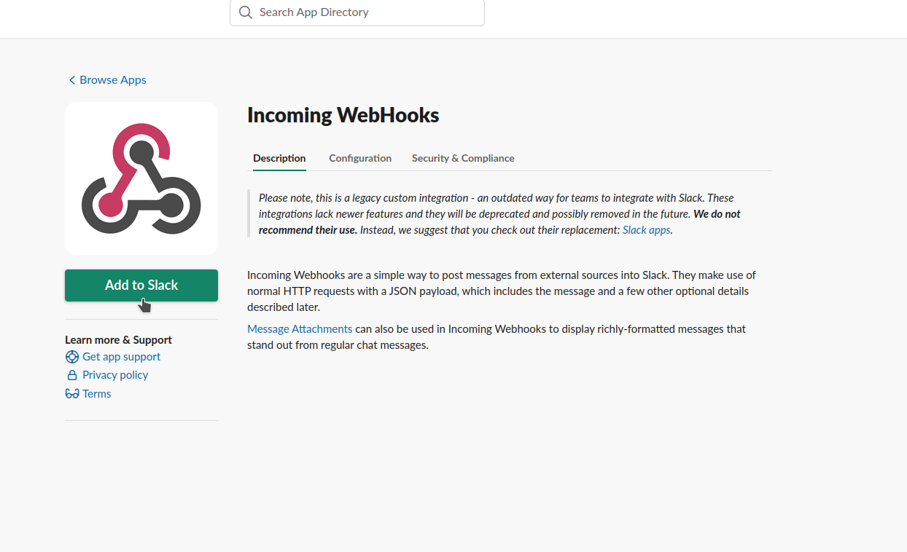
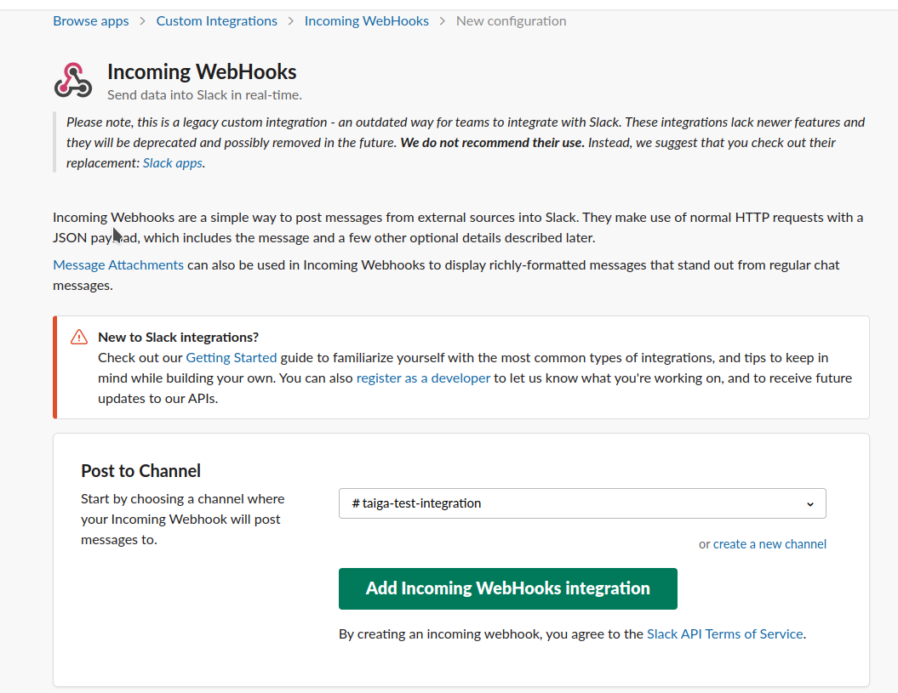
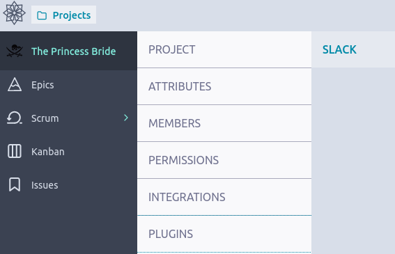
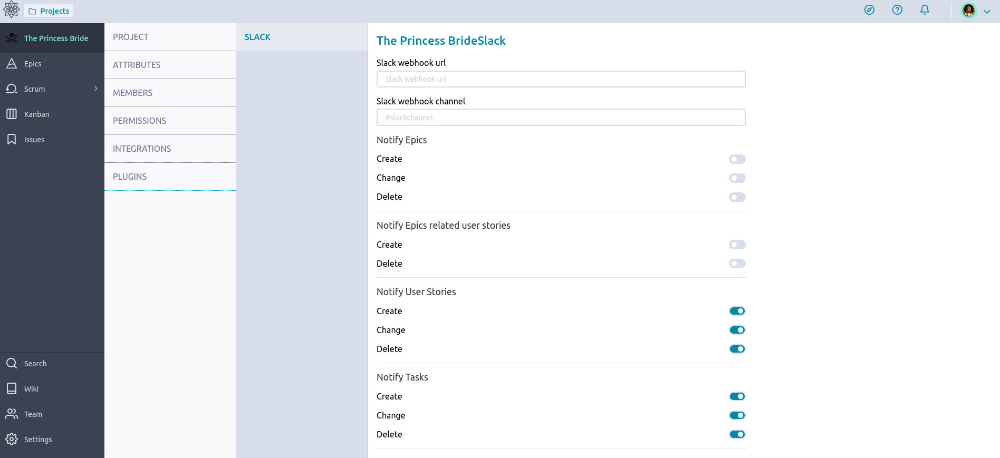

= Slack Integration
:toc: left
:numbered:
:source-highlighter: pygments
:pygments-style: friendly

*Slack is a platform for team communication.*

First things first, Slack is a huge platform with lots of features. Integration will always take time so please be patient. If you need a specific integration and you feel ready to get out your machete and start cutting into the taiga, please review our link:http://docs.taiga.io/api.html[API Docs].

If you need help with a specific feature, you can always get in touch with our community through our link:https://community.taiga.io/[community space].

== Configure Slack

Go to your slack app

* Select *Browser Slack > Apps*.

image::imgs/slack-integration-v2-0.png[Slack Integration Step 1]

* Type *webhook* and click *Add* of *Incoming WebHook* app.

image::imgs/slack-integration-v2-1.png[Slack Integration Step 1]

* Click *Configuration*.

* Click *Add to Slack*.

* Choose a channel and click *Add Incoming WebHooks Integration*.

* Copy your *Webhook URL*. You can change other settings here if you want.

image::imgs/slack-integration-v2-5.png[Slack Integration Step 1]

== Configure Taiga

In your project in Taiga:

* Go to *Admin > Contrib plugins > Slack*

* Set the *Slack webhook url* to the copied value in the previous step.

* You can also set the Slack channel which your project will post to. Leave the field blank if you wish to post to the default channel.

* Save your configuration.
