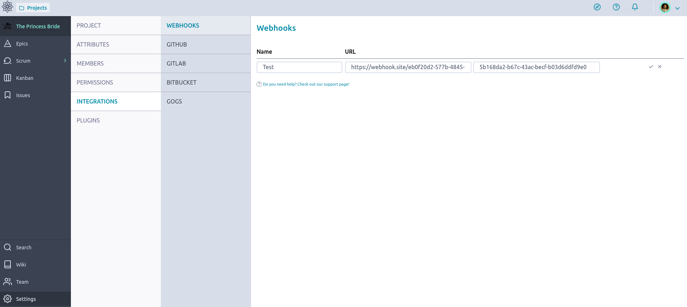

= Webhooks
:toc: left
:toclevels: 1
:numbered:
:source-highlighter: pygments
:pygments-style: friendly

Taiga comes with an easy third party integration system based on webhooks. Some applications can be integrated with it, and you can configure each one in Taiga.

== What is a webhook:

> A webHook is an HTTP callback: an HTTP POST that occurs when something happens; a simple event-notification via HTTP POST. A web application implementing webHooks will POST a message to a URL when certain things happen.

In other words a webhook is a way for an app to provide other applications with real-time information. A webhook delivers data to other applications as it happens, meaning you get data immediately.

Taiga emits a webhook when

- a sprint is created, updated or deleted.
- a user story is created, updated or deleted.
- a task is created, updated or deleted.
- an issue is created, updated or deleted.
- a wiki page is created, updated or deleted.

== First: Configure the third party service

First of all, be sure that the service supports the Taiga webhooks and it's able to understand and process the messages Taiga sends. If we are sure that it's possible we can start:

1. Go to your service and search for support about how to enable Taiga webhooks, and do it.
2. After enabling it, you need to Copy the *payload url* for the webhook and the *secret key*.
   - The *payload url* is the service endpoint that will receive the information sent by Taiga.
   - A *secret key* is a string (long is better) that is used to encrypt and decrypt a message so that only those who know the key can decrypt and read it.

== Second: Configure webhooks in Taiga

- Go to *Admin > Integrations > Webhooks*.

image::imgs/webhooks-1.png[Webhooks Panel]

- Fill the *name*, *secret key* and *payload url* based on the data provided by your service.

- Save the changes and the webhook will be created.

image::imgs/webhooks-3.png[Webhook created]

After creating a webhook you'll be able to edit, delete, or test if it works properly.

image::imgs/webhooks-4.png[Actions over a created webhook]

And you can view the history of the calls done.

image::imgs/webhooks-5.png[Webhook history entries list]

image::imgs/webhooks-6.png[Webhook history entry details]

== Developing your own integration

If you want to integrate your own system with the Taiga webhooks, you can see the technical documentation about link:webhooks.html[webhooks system].
